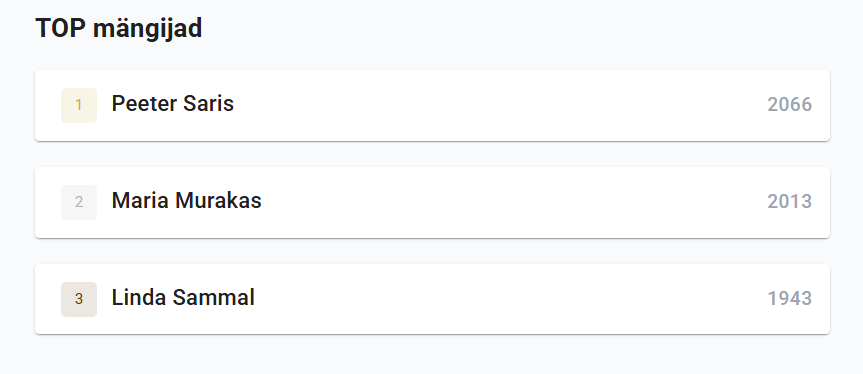

# Boonusülesanne

---

Klubi lehele saab fuktsionaalsusi juurde lisada. Üks selline asi oleks näiteks klubi top 3 mängija esile tõstmine.

Liigu lehele "Klubid" ja vali üks klubi.

See leht näitab juba mängijaid, kes klubis on, kuid oleks vaja juurde tekitada klubi mängijate top 3.

Selleks saab kasutada andmebaasi funktsooni f_klubiparimad()


## Ülesanne: loo klubi lehele poodium, kus on näha klubi 3 parimat mängijat, kasutades andmete pärimiseks funktsiooni f_klubiparimad()

Lahendus võiks näha välja midagi sellist, nagu on esilehel.



Kui ülesanne on lahendatud, lükka oma muudatused githubi üles ja esita oma repositooriumi link.

```bash
git add .
git commit -m "boonusülesanne"
git push
```
